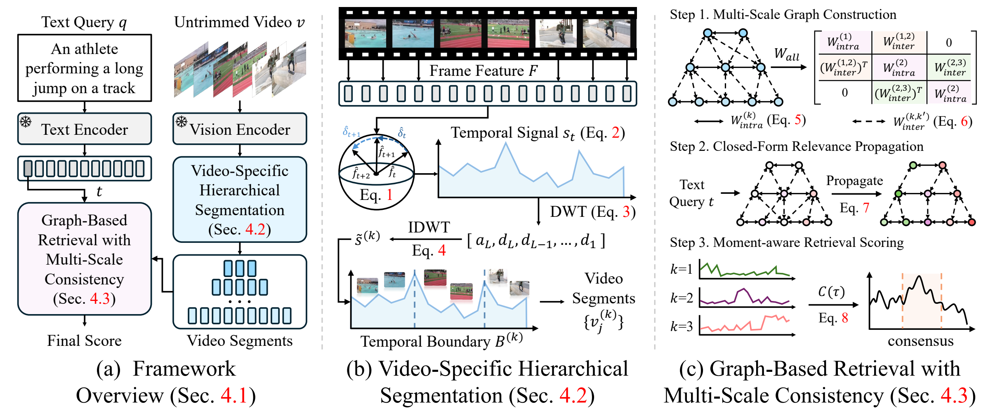
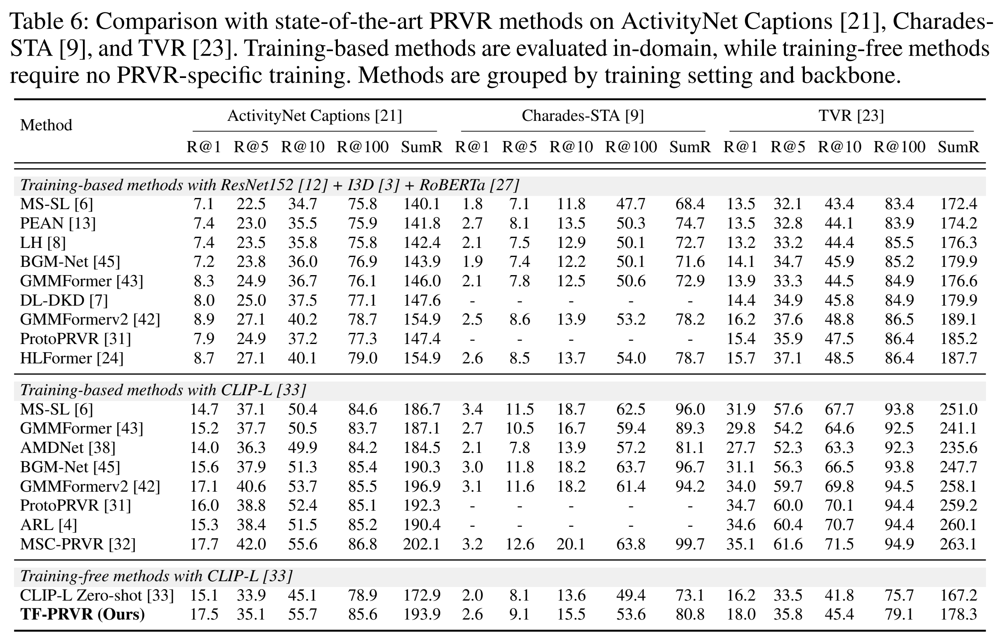

<h1 align="center">[NeurIPS 2026] TF-PRVR: Training-Free Partially Relevant Video Retrieval</h1>

<p align="center">
  <a href="https://giyeolkim.github.io/">Giyeol Kim</a> &nbsp;
  <a href="https://sites.google.com/view/pai-lab/members_1/faculty?authuser=0">Chanho Eom</a><sup>&dagger;</sup>
</p>

<p align="center">
  <a href="https://sites.google.com/view/pai-lab/home?authuser=0">Perceptual AI Lab</a>, GSAIM, Chung-Ang University
</p>

<p align="center">
  <sup>&dagger;</sup>Corresponding author
</p>

<p align="center">
  <a href="https://perceptualai-lab.github.io/TF-PRVR/">Project Page</a> &nbsp;|&nbsp; <a>Paper (NeurIPS)</a> &nbsp;|&nbsp; <a>arXiv</a>
</p>

---

> **Find the relevant moment. Retrieve the whole video.**<br>
> TF-PRVR retrieves untrimmed videos from natural-language queries using frozen vision-language features, adaptive temporal segments, and multi-scale relevance propagation—without task-specific training.

## Overview

Partially relevant video retrieval asks whether a video contains a moment matching a query. TF-PRVR adapts the temporal representation to each video and combines evidence from the same moment across scales.

<p align="center">
  <a href="assets/framework.png"></a>
</p>

1. **Video-specific hierarchical segmentation.** Changes in the direction of frame-feature evolution form a temporal semantic signal. Wavelet detail responses identify boundaries at multiple scales, yielding segments with coherent visual semantics.
2. **Graph-based relevance propagation.** A query-independent graph links segments through within-scale semantic similarity and temporal proximity, and through temporal overlap across adjacent scales.
3. **Moment-aware retrieval.** Query relevance is propagated through the graph, averaged across scales at each temporal location, and maximized over time to produce the video score.

**Frozen backbones · No PRVR-specific optimization · Query-independent video preprocessing**

## Results

### Generality across frozen backbones

TF-PRVR improves over the corresponding zero-shot baseline across all three evaluated backbones on **ActivityNet Captions** (Table 7a).

| Backbone | Zero-shot SumR | TF-PRVR SumR | Gain |
| :--- | ---: | ---: | ---: |
| CLIP-L/14 | 172.9 | **193.9** | +21.0 |
| SigLIP-L/14 | 178.7 | **198.5** | +19.8 |
| EVA-CLIP-L/14 | 180.4 | **200.8** | +20.4 |

### Benchmark comparison

TF-PRVR is evaluated alongside training-based approaches on **ActivityNet Captions**, **Charades-STA**, and **TVR** without PRVR-specific training. The training-based methods are evaluated in-domain.

<p align="center">
  <a href="assets/main-results.png"></a>
</p>

## Quick start

### 1. Install

```bash
git clone https://github.com/PerceptualAI-Lab/TF-PRVR.git
cd TF-PRVR
python -m venv .venv
source .venv/bin/activate
python -m pip install -r requirements.txt
```

Python 3.10 or newer is required. The feature-level retrieval pipeline runs on CPU with NumPy, SciPy, PyWavelets, and h5py.

### 2. Prepare pre-extracted features

This release provides the core feature-level retrieval pipeline. Supply features extracted by a frozen image–text encoder pair, such as **EVA-CLIP-L/14**.

| File | HDF5 dataset key | Array shape | Content |
| :--- | :--- | :--- | :--- |
| `videos.h5` | Video ID | `[T, D]` | Chronologically ordered, uniformly sampled frame embeddings |
| `queries.h5` | Query ID | `[D]` | Projected EOS embedding in the same shared space |

Feature dimensions are inferred. Frame sequences may have different lengths and must not contain padding. Use root-level HDF5 datasets with IDs that do not contain `/`. Both modalities must use the same encoder pair and projection space. An optional root attribute, `backbone`, can identify that pair in both files.

For evaluation, prepare one JSONL record per query with all relevant video IDs:

```json
{"query_id": "query_0001", "video_ids": ["video_0042"]}
{"query_id": "query_0002", "video_ids": ["video_0017", "video_0023"]}
```

### 3. Build the video index

```bash
python main.py index \
  --videos data/videos.h5 \
  --index outputs/index.h5
```

### 4. Retrieve and evaluate

```bash
python main.py search \
  --index outputs/index.h5 \
  --queries data/queries.h5 \
  --annotations data/queries.jsonl \
  --output outputs/rankings.jsonl \
  --batch-size 64 \
  --top-k 100
```

Omit `--annotations` for retrieval only. Rankings are saved as JSONL, and evaluation prints R@1, R@5, R@10, R@100, and SumR. Recall is computed against the full candidate set independently of the number of saved results. Ties follow lexicographic video ID order. Existing output files are preserved; choose a new output path for another run.

## Implementation

| File | Role |
| :--- | :--- |
| [`model.py`](model.py) | Semantic signal, wavelet segmentation, graph construction, propagation, and scoring |
| [`data.py`](data.py) | HDF5 feature loading and explicit query-to-video annotations |
| [`main.py`](main.py) | Offline indexing and batched retrieval/evaluation |
| [`requirements.txt`](requirements.txt) | Runtime and research-environment dependencies |

## Citation

Citation information will be available soon.
