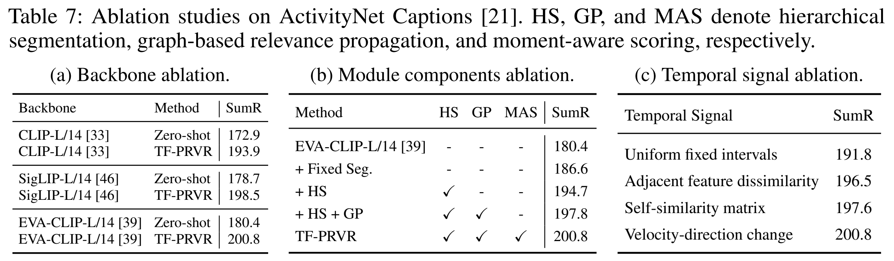

<div align="center">

# TF-PRVR

### Training-Free Partially Relevant Video Retrieval<br>for Real-World Generalization

**Giyeol Kim · Chanho Eom**<br>
Chung-Ang University


**Accepted to NeurIPS 2026**

[Overview](#overview) · [Results](#results) · [Quick start](#quick-start) · [Implementation](#implementation) · [Citation](#citation)

</div>

---

> **Find the relevant moment. Retrieve the whole video.**<br>
> TF-PRVR retrieves untrimmed videos from natural-language queries using frozen vision-language features, adaptive temporal segments, and multi-scale relevance propagation—without task-specific training.

## Overview

Partially relevant video retrieval asks whether a video contains a moment matching a query. TF-PRVR adapts the temporal representation to each video and combines evidence from the same moment across scales.

<p align="center">
  <a href="assets/framework.png"></a>
</p>
<p align="center"><em>Framework overview from Figure 4. Click any figure or table to view the full-resolution image.</em></p>

1. **Video-specific hierarchical segmentation.** Changes in the direction of frame-feature evolution form a temporal semantic signal. Wavelet detail responses identify boundaries at multiple scales, yielding segments with coherent visual semantics.
2. **Graph-based relevance propagation.** A query-independent graph links segments through within-scale semantic similarity and temporal proximity, and through temporal overlap across adjacent scales.
3. **Moment-aware retrieval.** Query relevance is propagated through the graph, averaged across scales at each temporal location, and maximized over time to produce the video score.

**Frozen backbones · No PRVR-specific optimization · Query-independent video preprocessing**

## Results

Results in this section are reported in the paper. **SumR** is the sum of R@1, R@5, R@10, and R@100, with recalls expressed as percentages.

### Generality across frozen backbones

TF-PRVR improves over the corresponding zero-shot baseline across all three evaluated backbones on **ActivityNet Captions** (Table 7a).

| Backbone | Zero-shot SumR | TF-PRVR SumR | Gain |
| :--- | ---: | ---: | ---: |
| CLIP-L/14 | 172.9 | **193.9** | +21.0 |
| SigLIP-L/14 | 178.7 | **198.5** | +19.8 |
| EVA-CLIP-L/14 | 180.4 | **200.8** | +20.4 |

### Benchmark comparison

The paper compares TF-PRVR with training-based approaches on **ActivityNet Captions**, **Charades-STA**, and **TVR**. Training-based methods below are evaluated in-domain; TF-PRVR uses no PRVR-specific training.

<p align="center">
  <a href="assets/main-results.png"></a>
</p>

### What contributes to retrieval quality?

The ablations on ActivityNet Captions examine the frozen backbone, hierarchical segmentation, graph propagation, moment-aware scoring, and temporal signal design.

<p align="center">
  <a href="assets/ablations.png"></a>
</p>

## Quick start

### 1. Install

```bash
git clone https://github.com/PerceptualAI-Lab/TF-PRVR.git
cd TF-PRVR
python -m venv .venv
source .venv/bin/activate
python -m pip install -r requirements.txt
```

Python 3.10 or newer is required. The feature-level retrieval pipeline runs on CPU with NumPy, SciPy, PyWavelets, and h5py. The requirements also include PyTorch, torchvision, and common PRVR research utilities.

### 2. Prepare pre-extracted features

This release provides the core feature-level retrieval pipeline. Supply features extracted by a frozen image–text encoder pair, such as **EVA-CLIP-L/14**. Feature extraction scripts, pretrained feature files, and benchmark-specific configurations are not bundled.

| File | HDF5 dataset key | Array shape | Content |
| :--- | :--- | :--- | :--- |
| `videos.h5` | Video ID | `[T, D]` | Chronologically ordered, uniformly sampled frame embeddings |
| `queries.h5` | Query ID | `[D]` | Projected EOS embedding in the same shared space |

Feature dimensions are inferred. Frame sequences may have different lengths and must not contain padding. Use root-level HDF5 datasets with IDs that do not contain `/`. Both modalities must use the same encoder pair and projection space. An optional root attribute, `backbone`, can identify that pair in both files.

For evaluation, prepare one JSONL record per query with all relevant video IDs:

```json
{"query_id": "query_0001", "video_ids": ["video_0042"]}
{"query_id": "query_0002", "video_ids": ["video_0017", "video_0023"]}
```

### 3. Build the video index

```bash
python main.py index \
  --videos data/videos.h5 \
  --index outputs/index.h5
```

Video segmentation, graph propagation, and temporal consensus are precomputed once per video. Defaults are `--wavelet db4` and `--beta 0.7`.

### 4. Retrieve and evaluate

```bash
python main.py search \
  --index outputs/index.h5 \
  --queries data/queries.h5 \
  --annotations data/queries.jsonl \
  --output outputs/rankings.jsonl \
  --batch-size 64 \
  --top-k 100
```

Omit `--annotations` for retrieval only. Rankings are saved as JSONL, and evaluation prints R@1, R@5, R@10, R@100, and SumR. Recall is computed against the full candidate set independently of the number of saved results. Ties follow lexicographic video ID order. Existing output files are preserved; choose a new output path for another run.

## Implementation

| File | Role |
| :--- | :--- |
| [`model.py`](model.py) | Semantic signal, wavelet segmentation, graph construction, propagation, and scoring |
| [`data.py`](data.py) | HDF5 feature loading and explicit query-to-video annotations |
| [`main.py`](main.py) | Offline indexing and batched retrieval/evaluation |
| [`requirements.txt`](requirements.txt) | Runtime and research-environment dependencies |

### Offline computation, efficient online scoring

Let $H$ contain the normalized segment features and $W_{\mathrm{norm}}$ be the symmetrically normalized graph. Relevance propagation is

$$
K=(1-\beta)(I-\beta W_{\mathrm{norm}})^{-1}, \qquad r^*=KH\hat{q}.
$$

Let $A$ average the covering segments across scales for each temporal interval. The implementation caches $Z=AKH$ and computes

$$
S(v,q)=\max_{\tau}(Z\hat{q})_{\tau}.
$$

This is algebraically equivalent to explicit query relevance propagation followed by moment-aware scoring. It avoids storing a dense propagation kernel for every video. Cached features are not normalized again, and negative query similarities are retained.

<details>
<summary><strong>Segmentation, graph, and numerical conventions</strong></summary>

- Frame features are normalized before temporal differencing and segment averaging. Consecutive stationary steps produce zero temporal change. Near-zero pooled features remain zero.
- Each db4 detail component is reconstructed with symmetric extension. Local maxima above the absolute response mean plus standard deviation define boundaries. A response peak at zero-based index `i` splits before frame `i + 2`.
- Decomposition depth uses the signal length and wavelet filter length. Short sequences use one whole-video segment; scales without detected peaks also retain one whole-video segment.
- Within-scale edges sum positive cosine similarity and exponential temporal proximity. The temporal scale is the mean segment duration at that level.
- Adjacent-scale edges multiply temporal IoU by positive cosine similarity and are inserted in both directions. One unit self-loop per node precedes symmetric degree normalization.
- A positive-definite linear solve implements propagation with `beta=0.7`. No iterative convergence threshold is needed.
- Consensus is evaluated on every interval between the union of segment boundaries. Half-open spans `[start, end)` give a unique covering segment per scale and preserve short intervals.
- Preprocessing uses dense graphs and linear solves; time and memory depend on the number of detected segments. Retrieval batches queries and loads one video's cached features at a time.
- The cache format is `tf-prvr-v2`; older indices must be rebuilt with `index`.

</details>

## Citation

If you find this work useful, please cite:

```bibtex
@inproceedings{kim2026tfprvr,
  title     = {{TF-PRVR}: Training-Free Partially Relevant Video Retrieval for Real-World Generalization},
  author    = {Kim, Giyeol and Eom, Chanho},
  booktitle = {Advances in Neural Information Processing Systems},
  year      = {2026},
  url       = {https://github.com/PerceptualAI-Lab/TF-PRVR}
}
```

## Acknowledgements

We thank the authors of MSC-PRVR and prior PRVR methods for their publicly available implementations, which informed the data-loading and evaluation conventions used in this repository.
